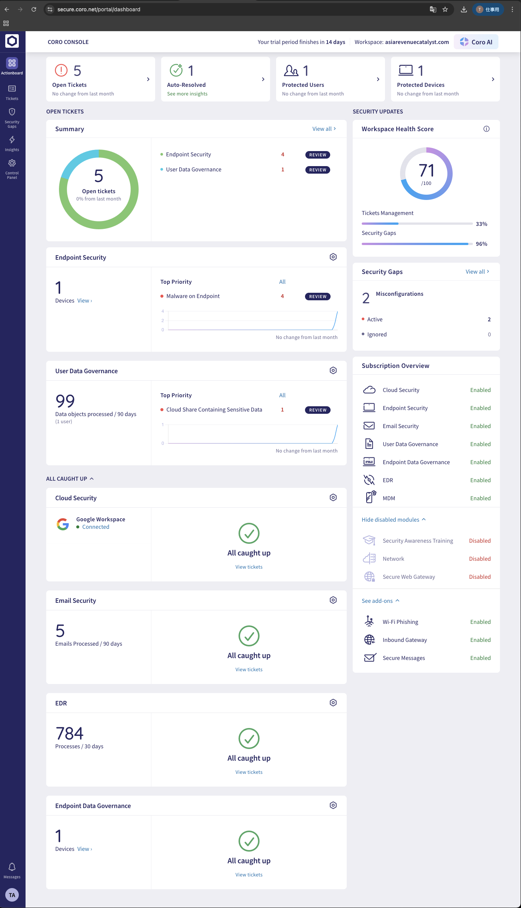
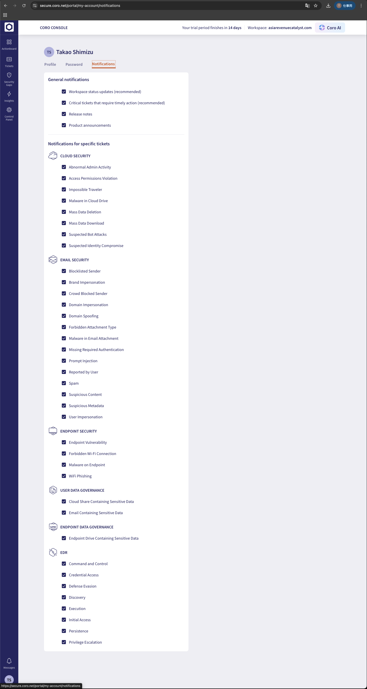

# Coro Release Notes Detailed Analysis

## Target Versions

| Version | Release Date | Type |
|---------|--------------|------|
| v3.7 | November 16, 2025 | Major Release |
| v3.8 | December 14, 2025 | Major Release |

## Evaluation Environment Constraints

> **Important**: In this analysis, some features are out of scope due to the following constraints.
> Out-of-scope items are marked with ~~strikethrough~~ or "Out of Scope".

| Category | In Scope | Out of Scope |
|----------|----------|--------------|
| **Cloud Services** | Google Workspace | Microsoft 365 |
| **Devices/OS** | macOS, Linux | Windows |
| **Sensitive Data Detection Regions** | English-speaking regions, Japan | UAE, Brazil, Others |
| **Languages** | English, Japanese | French, Others |

---

# Part 1: v3.7 Release Notes Analysis

## 1. New Features

### 1.1 Coro Console

> **Reference**: See the actual Actionboard redesign screen below
> 

| Feature ID | Feature Name | Description | Impact Area |
|------------|--------------|-------------|-------------|
| 1.1 | Actionboard redesign | Dashboard redesign (open ticket summary, links to protected devices/users, workspace health score) | UI/UX |
| 1.2 | Updated ticket structure | Ticket detail pane redesign (4-tab structure: Overview, Full details, Activity logs, Comments) | Ticket management |
| 1.3 | Updated ticket closure policies | Auto-close policy after 10 days (Cloud/Email/Endpoint Security, Data Governance) | Operations flow |
| 1.4 | Bulk ticket actions | Bulk actions on multiple tickets | Operational efficiency |
| 1.5 | Global allowlists and blocklists | Global allow/blocklists for MSP admins (EDR, Email, Endpoint Security) | MSP management |

### 1.2 Cloud Security

| Feature ID | Feature Name | Description | Impact Area |
|------------|--------------|-------------|-------------|
| 2.1 | Threat detection policies | New threat detection policies (Abnormal Admin Activity, Mass Data Deletion/Download, Bot Attack, Identity Compromise) | Security policies |

### 1.3 Endpoint Security

| Feature ID | Feature Name | Description | Impact Area | Evaluation Status |
|------------|--------------|-------------|-------------|-------------------|
| 3.1 | Remote Agent uninstallation | Remote Agent uninstallation for Windows devices | Device management | Out of Scope (Windows) |
| 3.2 | USB Lockdown allowlisting | USB device allowlist by serial number | Device policies | In Scope |

### 1.4 Network and SWG

| Feature ID | Feature Name | Description | Impact Area |
|------------|--------------|-------------|-------------|
| 4.0 | Module split | Network module split into Network (VPN/ZTNA) and SWG (DNS filtering) | Architecture |
| 4.1 | DNS filtering allowlists/blocklists | DNS filtering lists applied by device label | Network policies |
| 4.2 | Shadow AI blocklist | Default list for blocking AI chatbots | AI security |
| 4.3 | Improved DNS summary report | DNS summary report layout improvement | Reporting |
| 4.4 | Virtual office Brazil server | Brazil region VPN server addition | Infrastructure |

### 1.5 Email Security

> **Reference**: Prompt Injection can be confirmed in the notification settings screen
> 

| Feature ID | Feature Name | Description | Impact Area |
|------------|--------------|-------------|-------------|
| 5.1 | Prompt injection detection | AI prompt injection detection in emails | **Important** AI security |
| 5.2 | User reports of quarantined emails | User notification reports for quarantined emails | User notifications |
| 5.3 | Delete auto-forwarding rules | Auto-forwarding rule deletion feature | Data leak prevention |

### 1.6 Data Governance

| Feature ID | Feature Name | Description | Impact Area | Evaluation Status |
|------------|--------------|-------------|-------------|-------------------|
| 6.1 | Unified ticket - Cloud/Email | Sensitive data ticket consolidation for cloud sharing/email | Ticket management | In Scope |
| 6.2 | Unified ticket - Endpoint | Sensitive data ticket consolidation for endpoint drive scans | Ticket management | In Scope |
| 6.3 | UAE sensitive data detection | UAE-specific sensitive data detection (5 types: ID, passport, etc.) | Compliance | Out of Scope (UAE region) |

### 1.7 MDM

| Feature ID | Feature Name | Description | Impact Area |
|------------|--------------|-------------|-------------|
| 7.1 | Demo mode | MDM service demo data provision | Demo/Evaluation |

### 1.8 Coro AI

| Feature ID | Feature Name | Description | Impact Area |
|------------|--------------|-------------|-------------|
| 8.1 | Global view AI summary | AI summary added to global view | AI features |

## 2. Enhancements

### 2.1 Cloud Security

| Item | Content |
|------|---------|
| Impossible Traveler ticket | Improved event description, city/state details, distance (km), event count display |

### 2.2 Coro Console

| Item | Content | Evaluation Status |
|------|---------|-------------------|
| French (Canada) support | French (Canada) UI support added | Out of Scope (French) |

### 2.3 EDR

| Item | Content |
|------|---------|
| EDR settings | EDR protection enable/disable settings |
| Additional ticket info | Additional details for Privilege Escalation/Credential Access/Persistence tickets |
| Allowlist/blocklist UI | UI simplification |

### 2.4 Endpoint Security

| Item | Content |
|------|---------|
| Allowlist/blocklist UI | UI simplification |
| Container hash | Container hash display on malware detection |
| Self-update setting | Auto-update enable/disable setting |

### 2.5 Email Security

| Item | Content |
|------|---------|
| Inbound Gateway test | Pre-DNS change test, end-to-end test |
| Localized warning banner | Warning banner workspace language support |
| Disconnected status | Improved connection status display when permissions insufficient |

## 3. Fixed Issues

| Issue | Fix | Evaluation Status |
|-------|-----|-------------------|
| Activity Log Undo action | Undo action added for device protection disable | In Scope |
| User aliases sync | Microsoft 365/Google Workspace alias sync | In Scope (Google Workspace only) |
| Reported by User tickets | Correct protected user status display | In Scope |

## 4. Agent Updates

### 4.1 Linux Agent 3.7 - In Scope

| Feature | Description |
|---------|-------------|
| Disable protection | Linux protection disable support |
| Remote shell | Remote shell access |
| Bug fixes | General bug fixes |

### 4.2 macOS Agent 3.7 - In Scope

| Feature | Description |
|---------|-------------|
| Scheduled malware scan | Scheduled malware scan |
| Optimized performance | EDR/on-access scan performance optimization |
| Bug fixes | General bug fixes |

### 4.3 Windows Agent 3.7 - Out of Scope

> **Note**: This section is out of scope as Windows environment is not available.

| Feature | Description |
|---------|-------------|
| ~~Remote uninstallation~~ | ~~Remote uninstallation support~~ |
| ~~Optimized scan~~ | ~~Boot-time scan performance improvement~~ |
| ~~Enhanced malware reporting~~ | ~~Parent container reporting for malware in container files~~ |
| ~~Bug fixes~~ | ~~General bug fixes~~ |

---

# Part 2: v3.8 Release Notes Analysis

## 1. New Features

### 1.1 Coro Console

| Feature ID | Feature Name | Description | Impact Area |
|------------|--------------|-------------|-------------|
| 1.1 | Onboarding for new workspaces | Setup Hub onboarding checklist | Initial setup |
| 1.2 | Hierarchy tree for Workspaces | Workspace hierarchy tree display (for MSPs) | MSP management |
| 1.3 | Security gaps | New security gap detection (Cloud/Devices/Data Governance) | Security audit |
| 1.4 | Workspace filter for Actionboard | All workspaces/subscriptions only filter | MSP management |
| 1.5 | Date range filter for Insights | Coro Insights date range filter | Reporting |
| 1.6 | Agent health filter | Device page agent health filter | Device management |
| 1.7 | Remote shell for Linux | Linux device remote shell support | Remote management |

### 1.2 Cloud Security

| Feature ID | Feature Name | Description | Impact Area | Evaluation Status |
|------------|--------------|-------------|-------------|-------------------|
| 2.1 | MFA status detection | Microsoft 365/Google Workspace MFA status detection & display | **Important** Security monitoring | In Scope (Google Workspace only) |

### 1.3 Email Security

| Feature ID | Feature Name | Description | Impact Area |
|------------|--------------|-------------|-------------|
| 3.1 | Auto-forwarding rules UI | UI display for users affected by external auto-forwarding rule deletion policy | User management |

### 1.4 Data Governance

| Feature ID | Feature Name | Description | Impact Area | Evaluation Status |
|------------|--------------|-------------|-------------|-------------------|
| 4.1 | Brazil sensitive data detection | Brazil-specific sensitive data detection (5 types: CPF, passport, etc.) | Compliance | Out of Scope (Brazil region) |

### 1.5 Security Awareness Training (SAT)

| Feature ID | Feature Name | Description | Impact Area |
|------------|--------------|-------------|-------------|
| 5.1 | Multi-language support | Multi-language support for simulations/training (6 languages) | International support |
| 5.2 | Selection by user label | SAT target selection by user label | User management |

### 1.6 Coro AI

| Feature ID | Feature Name | Description | Impact Area |
|------------|--------------|-------------|-------------|
| 6.1 | Security gap summary report | AI-powered security gap summary and recommendations | AI features |

## 2. Enhancements

### 2.1 Cloud Security

| Item | Content |
|------|---------|
| IP address exclusion | Renamed from "VPN Exclusions" to "IP Address Exclusions" with improved description |

### 2.2 SWG

| Item | Content |
|------|---------|
| DNS filtering while disabled | DNS filtering settings can be changed while disabled |

---

# Part 3: Feature Category Summary

## 1. Security Feature Category

### 1.1 AI/ML-related Security

| Version | Feature | Importance |
|---------|---------|------------|
| v3.7 | Prompt injection detection (Email) | **High** |
| v3.7 | Shadow AI blocklist (SWG) | Medium |
| v3.7/3.8 | Coro AI summary features | Medium |

### 1.2 Authentication & Access Control

| Version | Feature | Importance | Evaluation Status |
|---------|---------|------------|-------------------|
| v3.8 | MFA status detection (Google Workspace) | **High** | In Scope |
| v3.7 | Threat detection policies | High | In Scope |

### 1.3 Data Protection & Compliance

| Version | Feature | Importance | Evaluation Status |
|---------|---------|------------|-------------------|
| v3.7 | UAE sensitive data detection | Medium | Out of Scope |
| v3.8 | Brazil sensitive data detection | Medium | Out of Scope |
| v3.7 | Unified ticket (sensitive data) | Medium | In Scope |

### 1.4 Device Management

| Version | Feature | Importance | Evaluation Status |
|---------|---------|------------|-------------------|
| v3.7 | Remote Agent uninstallation (Windows) | Medium | Out of Scope |
| v3.7 | USB Lockdown allowlisting | Medium | In Scope |
| v3.8 | Agent health filter | Low | In Scope |

### 1.5 Network Security

| Version | Feature | Importance |
|---------|---------|------------|
| v3.7 | Network/SWG module split | Medium |
| v3.7 | DNS filtering allowlists/blocklists | Medium |

## 2. Operational Efficiency Category

### 2.1 UI/UX Improvements

| Version | Feature |
|---------|---------|
| v3.7 | Actionboard redesign |
| v3.7 | Updated ticket structure |
| v3.8 | Hierarchy tree for Workspaces |
| v3.8 | Setup Hub onboarding |

### 2.2 Bulk Operations & Automation

| Version | Feature |
|---------|---------|
| v3.7 | Bulk ticket actions |
| v3.7 | Auto ticket closure (10 days) |
| v3.7 | Delete auto-forwarding rules |

### 2.3 Filtering & Search

| Version | Feature |
|---------|---------|
| v3.8 | Workspace filter for Actionboard |
| v3.8 | Date range filter for Insights |
| v3.8 | Agent health filter |

---

# Part 4: Evaluation Criteria Summary

## 1. Feature Evaluation Criteria

### 1.1 Security Effectiveness

- [ ] Response capability to new threat types
- [ ] Detection accuracy (False Positive/Negative)
- [ ] Automation level of response

### 1.2 Operability

- [ ] UI/UX usability
- [ ] Configuration flexibility
- [ ] Efficiency of bulk operations

### 1.3 Integration

- [ ] Cloud application integration
- [ ] Agent feature consistency
- [ ] API features

### 1.4 Compliance

- [ ] Comprehensiveness of regional data detection
- [ ] Reporting features
- [ ] Audit trails

## 2. Priority Evaluation Items (v3.7/v3.8)

> **Note**: Evaluation scope has been updated based on environment constraints.

### Highest Priority

1. **Prompt injection detection** - New AI security threat
2. **MFA status detection (Google Workspace)** - Basic security posture visibility

### High Priority

3. **Threat detection policies** - New detection types
4. **Shadow AI blocklist** - Generative AI usage control
5. **Security gaps detection** - Security posture improvement

### Medium Priority

6. **Unified ticket consolidation** - Operational efficiency
7. ~~**Remote Agent uninstallation**~~ - ~~Device management~~ (Out of scope - Windows feature)
8. **Setup Hub onboarding** - Initial deployment

### Additional Evaluation Items (macOS/Linux focused)

9. **macOS Agent 3.7** - Scheduled scan, EDR performance optimization
10. **Linux Agent 3.7** - Protection disable, remote shell
11. **Remote shell for Linux (v3.8)** - Linux remote management

---

## Appendix: Out of Scope Items List

| Category | Item | Exclusion Reason |
|----------|------|------------------|
| Agent | All Windows Agent 3.7 features | No Windows environment |
| Endpoint Security | Remote Agent uninstallation | Windows-only feature |
| Data Governance | UAE sensitive data detection | Region not in scope |
| Data Governance | Brazil sensitive data detection | Region not in scope |
| Language | French (Canada) support | Language not in scope |
| Cloud Security | Microsoft 365-related features | No M365 environment |

---

*Created Date: 2026-01-22*
*Last Updated: 2026-01-22 (Constraints added)*
*Analysis Target: v3.7 (2025-11-16), v3.8 (2025-12-14)*
*Document Version: 1.1*
