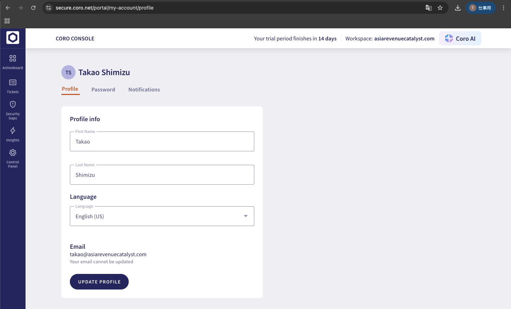

# スクリーンショット索引 / Screenshots Index

## 概要 / Overview

評価作業で取得したCoroコンソールのスクリーンショット一覧です。
This is a list of Coro Console screenshots captured during the evaluation.

---

## スクリーンショット一覧 / Screenshot List

### 1. Actionboardダッシュボード / Actionboard Dashboard

**ファイル / File**: `img/actionboard-dashboard.png`


**内容 / Content**:
- Coroコンソールのメインダッシュボード / Coro Console main dashboard
- Workspace Health Score: 71/100
- Security Gaps: 96%（2 Misconfigurations）
- Google Workspace: Connected

**関連評価項目 / Related Evaluation Items**:
- MGT-CON-001: Actionboard Redesign
- MGT-CON-006: Security Gaps

**関連ドキュメント / Related Documents**:
- `docs/analysis/coro-service-overview.md` - セクション 3.1
- `docs/analysis/release-notes-analysis.md` - セクション 1.1

---

### 2. ユーザープロファイル設定 / User Profile Settings

**ファイル / File**: `img/user-profile-settings.png`



**内容 / Content**:
- ユーザープロファイル設定画面 / User profile settings screen
- 言語設定: English (US) / Language setting: English (US)
- Profile, Password, Notifications タブ / Profile, Password, Notifications tabs

**関連評価項目 / Related Evaluation Items**:
- CMP-LOC-001: 英語UI / English UI

**関連ドキュメント / Related Documents**:
- `docs/evaluation-plan.md` - セクション 3.3.2

---

### 3. 通知設定（脅威タイプ一覧） / Notification Settings (Threat Types)

**ファイル / File**: `img/notification-settings-threat-types.png`


**内容 / Content**:
- 通知設定画面 / Notification settings screen
- モジュール別の脅威タイプ一覧 / Threat types by module

**確認できる脅威タイプ / Visible Threat Types**:

| モジュール / Module | 脅威タイプ / Threat Types |
|---------------------|---------------------------|
| **Cloud Security** | Abnormal Admin Activity, Access Permissions Violation, Impossible Traveler, Malware in Cloud Drive, Mass Data Deletion, Mass Data Download, Suspected Bot Attacks, Suspected Identity Compromise |
| **Email Security** | Blocklisted Sender, Brand Impersonation, Crowd Blocked Sender, Domain Impersonation, Domain Spoofing, Forbidden Attachment Type, Malware in Email Attachment, Missing Required Authentication, **Prompt Injection**, Reported by User, Spam, Suspicious Content, Suspicious Metadata, User Impersonation |
| **Endpoint Security** | Endpoint Vulnerability, Forbidden Wi-Fi Connection, Malware on Endpoint, WiFi Phishing |
| **User Data Governance** | Cloud Share Containing Sensitive Data, Email Containing Sensitive Data |
| **Endpoint Data Governance** | Endpoint Drive Containing Sensitive Data |
| **EDR** | Command and Control, Credential Access, Defense Evasion, Discovery, Execution, Initial Access, Persistence, Privilege Escalation |

**関連評価項目 / Related Evaluation Items**:
- SEC-AI-001: Prompt Injection Detection
- SEC-AUTH-002: Threat Detection Policies

**関連ドキュメント / Related Documents**:
- `docs/analysis/coro-service-overview.md` - セクション 3.4
- `docs/analysis/release-notes-analysis.md` - セクション 1.5

---

## 評価フェーズ別スクリーンショット / Screenshots by Evaluation Phase

| Phase | 取得済み / Captured | 未取得（今後必要） / Needed |
|-------|---------------------|------------------------------|
| **Phase 1: 環境準備** | Actionboard, User Profile | Agent設定画面、Google Workspace連携画面 |
| **Phase 2: セキュリティ機能** | 通知設定（脅威タイプ） | Prompt Injection検知結果、MFA状態表示 |
| **Phase 3: 管理機能** | Actionboard（Security Gaps含む） | Bulk Ticket Actions、Setup Hub |
| **Phase 4: コンプライアンス** | - | 機密データ検出結果、Agent機能画面 |

---

## ファイル命名規則 / File Naming Convention

スクリーンショットは以下の命名規則に従ってください：
Screenshots should follow this naming convention:

```
{機能名}-{画面名}.png
{feature-name}-{screen-name}.png
```

例 / Examples:
- `actionboard-dashboard.png`
- `mfa-status-detection.png`
- `prompt-injection-ticket.png`
- `security-gaps-list.png`

---

*作成日 / Created: 2026-01-22*
*更新日 / Updated: 2026-01-22*
